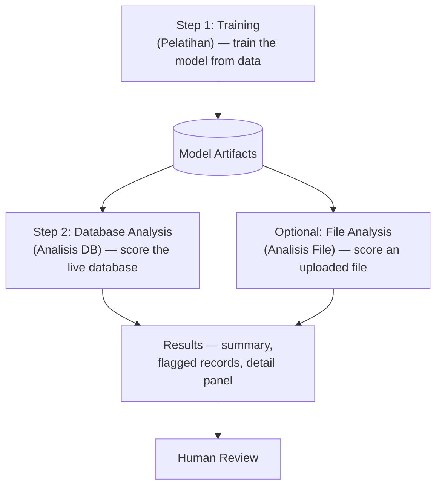
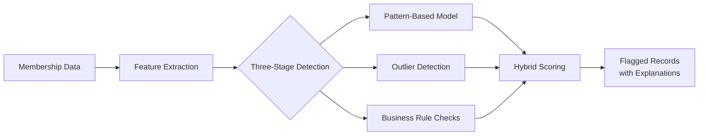

# Membership Anomaly Detection — Formal Overview

*Feature: anomaly detection for BPJS membership data · Route: `/analitik/anomali` · 1 July 2026*

---

## Overview

**Membership Anomaly Detection** (*Deteksi Anomali Kepesertaan* in the interface) is the
feature within the *Analitik & AI* section dedicated to detecting anomalous patterns in
BPJS membership data. It analyzes enrollment records and surfaces entries that deviate
from expected patterns — such as impossible ages, internally inconsistent family
structures, or statistically unusual profiles — so that they can be reviewed by staff.

The feature is a **decision-support tool**. It does not modify or delete data, and it
makes no final determination on its own. Its purpose is to act as a first-pass filter that
directs human attention to the records most likely to warrant verification, a task that is
not feasible to perform manually across large volumes of data.

It is one of two related pages under *Analitik & AI*: this feature performs the detection
itself, while a separate visualization page provides dashboard views of the results. This
document describes the detection feature.

---

## How the Feature Is Used

The feature is operated through a defined three-step workflow. A status indicator at the
top of the page shows whether the underlying model is ready (*Model: Siap*) or has not yet
been trained (*Model: Belum Terlatih*), which governs whether analysis can be run.

The first step, **Training** (*Pelatihan*), is a periodic preparation activity. It builds
the pattern-based model from current data so that the system learns what normal membership
records look like. Until this has been completed at least once, the model is marked as not
ready and analysis cannot proceed.

Once a model exists, the second step is **Database Analysis** (*Analisis DB*), which
applies the saved model directly to the live membership database and produces flagged
results. As an alternative input, the optional **File Analysis** (*Analisis File*) path
allows an external BPJS data file to be analyzed under the same model instead. Whichever
input is chosen, the outcome is the same: a set of flagged records presented for **human
review**.

---

## How the Detection Works

For every record, the feature combines three complementary detection methods and merges
their judgements into a single result.

The first method is a **pattern-based model**. Trained on a large body of existing
records, it learns the typical structure of valid data — the relationships between age,
family role, activity status, and other attributes that normally hold true. When
evaluating new data, it estimates how well each record conforms to that learned pattern,
and records that diverge receive a higher anomaly score.

The second method is **outlier detection**. Where the pattern-based model measures
conformance to a learned shape, the outlier detector identifies records that are simply
distant from the rest of the population, regardless of any learned pattern. The two
perspectives are deliberately different, so they catch different kinds of irregularity.

The third method is a set of **business rules**. These are explicit, human-authored
constraints that encode domain knowledge — for example, that a family head cannot be a
young child, that an active member cannot be of an implausible age, or that a family
cannot contain an impossible number of members. Unlike the models, the rules are fully
transparent and can be revised by subject-matter experts without altering the underlying
analytics.

The process begins with **feature extraction**, in which the raw attributes of each record
are transformed and enriched — deriving values such as age, family composition, and
activity ratios — into the form the detection methods require. The prepared data then
passes through all three detection stages, and their individual outputs are reconciled
through **hybrid scoring** into a final flag accompanied by a plain-language explanation.
Because no single method bears the full responsibility, the combination is both more
robust and more explainable than any one technique alone.

---

## What the Analysis Produces

Each run yields a set of practical outputs. A **summary** describes the overall outcome —
the total data examined (*Total Data*), the number of anomalies detected (*Anomali
Terdeteksi*), and how those anomalies split between **business rules** and the **ML
model**. A **detail panel** (*Detail Anomali*) then presents the flagged records
themselves, each accompanied by an anomaly score and a human-readable explanation of the
factors that drove the flag. Each flag is also classified by its source — model, rules, or
both — which helps reviewers understand the nature of each finding and triage
accordingly.

---

## Relationship to openIMIS

It is worth clarifying that this detection capability is **proprietary to this system**
and is not a component of openIMIS. The two serve distinct purposes: this feature
**reviews** the membership data, while openIMIS **stores** it as the downstream system of
record. They are separate by design, and the detection process does not depend on openIMIS
in any way.

---

## Closing

Membership Anomaly Detection provides a fast, consistent, and explainable first-pass
review of membership data at a scale beyond manual reach. By combining a learned model,
statistical outlier detection, and explicit business rules, it offers a balanced
assessment of each record while keeping a human in control of the final decision.
