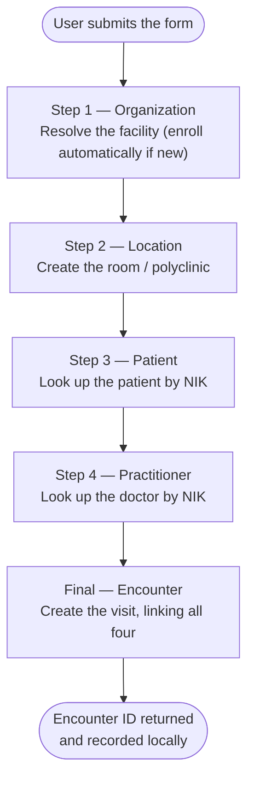

# SatuSehat Integration — Overview

The **SatuSehat Integration** page registers a patient's visit — an **Encounter** in the
FHIR R4 standard — to **SatuSehat**, Indonesia's national health-data exchange run by the
Ministry of Health. JKN governs health coverage and financing, while SatuSehat governs
clinical and visit data; the two are distinct systems, yet they share a single subject, the
patient. This integration bridges them by translating JKN member and facility data into
SatuSehat Patient, Coverage, and related resources, and by recording each visit as an
Encounter in the national record — the direction national policy is itself taking as
coverage and clinical data are increasingly used to validate one another.

Because a FHIR Encounter is a web of references rather than a standalone record, the system
assembles those references in a fixed sequence before creating it. It resolves the facility
as an Organization, enrolling it automatically if it is new; creates a Location for the room
or polyclinic; looks up the Patient and the Practitioner by national ID; and finally
submits an Encounter that ties all four together. Each step is shown live as it completes,
so the operator can follow the progress and see exactly where the process halts if anything
fails.

The present scope is best understood as a foundation rather than a closed loop. The
integration communicates with SatuSehat but not yet with BPJS itself — there is no
connection to the BPJS VClaim or PCare services, and no generation of an SEP, the
eligibility letter BPJS issues for a covered visit — so the registration is one-directional
and the Encounter carries no medical-record content or claim linkage. Completing that loop,
so that a single visit produces both a BPJS eligibility record and a SatuSehat Encounter
that reference each other, is the step that would make this bridge a fully operational part
of the coverage-to-care workflow.
